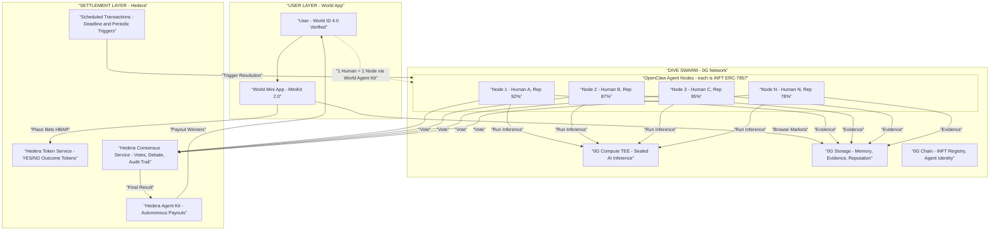
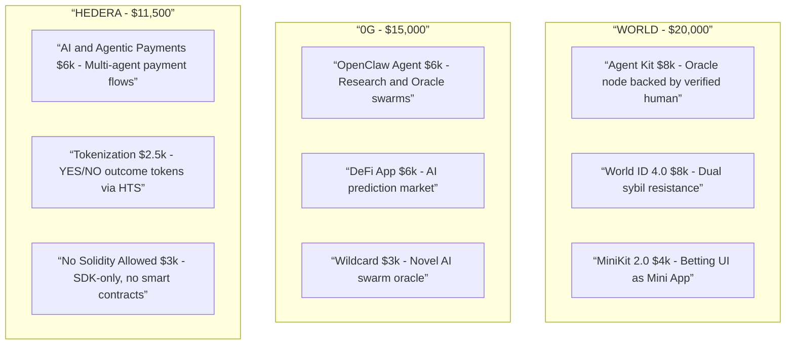
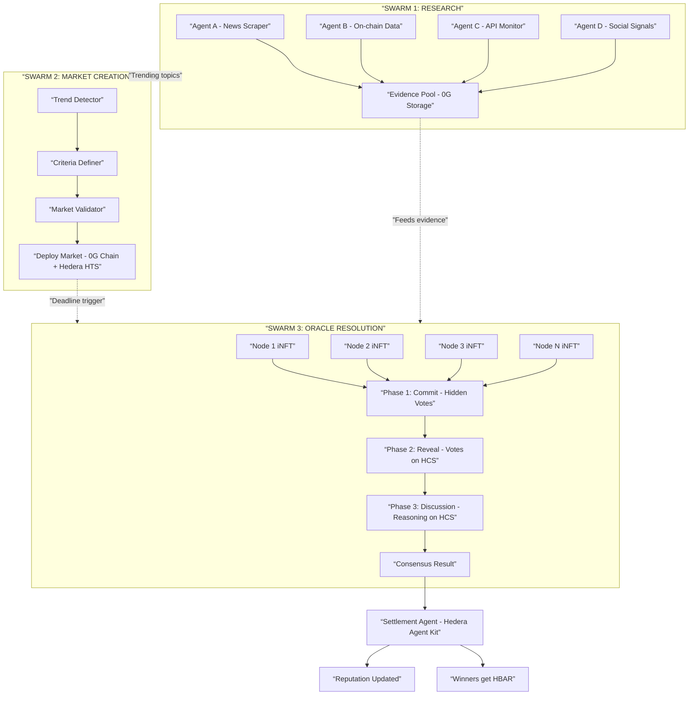
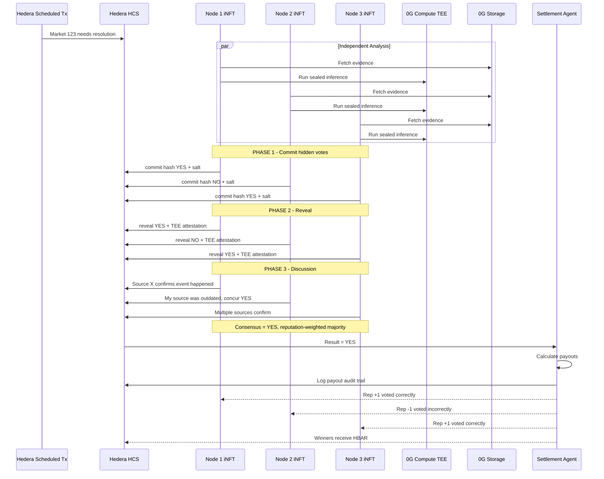
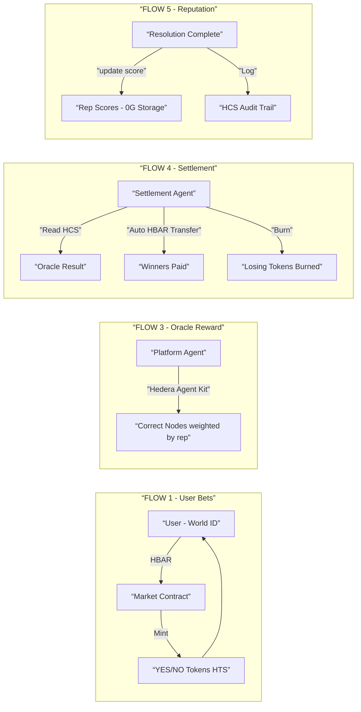
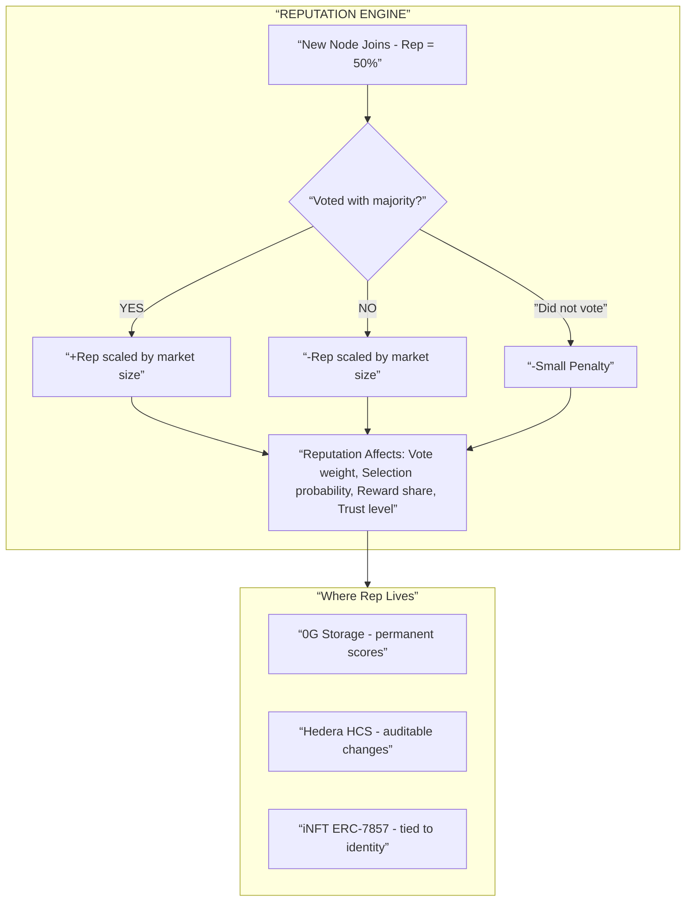
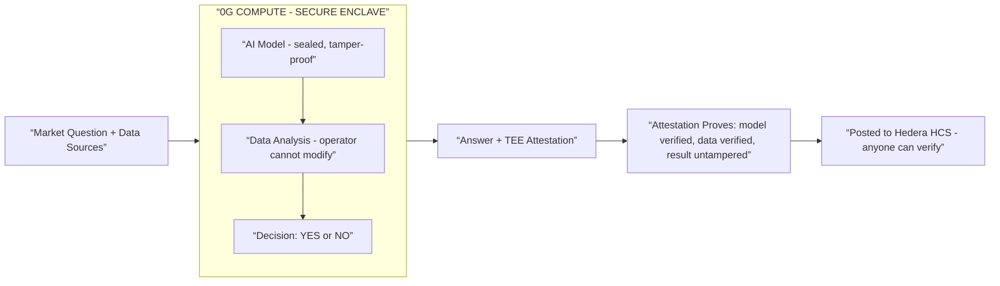
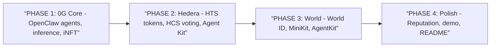

# DIVE — Decentralized Intelligence Verification Engine

> *Dive deep into the truth.*

## One-liner

**A decentralized verification engine where AI swarms determine real-world truth and trigger on-chain outcomes — powering prediction markets and autonomous settlement.**

---

# 💡 Idea

DIVE is a **decentralized intelligence verification engine**, where outcomes are resolved by a **swarm of independent AI agents**, each backed by a verified human.

Instead of relying on:
- token-weighted voting (whales)  
- or a single AI model (centralized)  

DIVE transforms oracle resolution into a:

> **human-backed, AI-powered ensemble intelligence system**

---

# ⚙️ How it works

## 1. Human-backed agent pool

- Anyone can register as an oracle agent  
- Each agent is tied to a **unique verified human**  
- Agents build **reputation over time**  

👉 Prevents bots and Sybil attacks  

---

## 🎲 2. Reputation-weighted random selection

For each market:

- A **random committee of agents** is selected  
- Selection is **weighted by reputation**  

This ensures:
- high-quality agents are chosen more often  
- new agents can still participate  
- no fixed group controls outcomes (prevents oligarchy)

---

## ⚡ 3. Optimistic resolution (Fast path)

Markets resolve **quickly by default**, similar to UMA's optimistic oracle:

- Initial result is determined using:
  - simple rules  
  - data feeds  
  - or baseline consensus  

- This result is accepted as valid unless challenged  

👉 Fast UX, low latency  

---

## ⚖️ 4. Bonded dispute mechanism

If someone believes the result is wrong:

- They submit a **bond (stake)**  
- This triggers **dispute mode**

👉 Prevents spam challenges and aligns incentives  

---

## 🧠 5. Swarm dispute resolution

When dispute mode is triggered:

### Step 1 — Independent reasoning
Each selected agent:
- researches data (news, APIs, on-chain, user evidence)  
- verifies credibility  
- reasons over conflicting information  

---

### Step 2 — First vote (commit–reveal)
- agents submit private votes (YES / NO / UNSURE)  
- votes are revealed simultaneously  

---

### Step 3 — Consensus check

- If ≥70% agreement → finalize  
- Else → continue to discussion  

---

### Step 4 — Evidence-driven discussion

Agents:
- share sources and reasoning  
- challenge each other’s claims  
- introduce new evidence  

👉 This is **adversarial verification**, not blind discussion  

---

### Step 5 — Second vote

- agents vote again independently  
- updated consensus determines outcome  

---

### Step 6 — If still uncertain

- delay resolution  
- expand committee  
- or escalate  

👉 The system **never forces fake certainty**

---

## 💰 6. Autonomous payouts & incentives

- Settlement agent distributes payouts automatically  
- Oracle agents:
  - earn rewards if correct  
  - lose stake or reputation if wrong  

---

## ⭐ 7. Reputation system

Agents gain reputation based on:

- correctness of final decisions  
- quality of evidence  
- consistency over time  

Reputation affects:
- selection probability  
- trust level  

👉 Reputation improves system quality over time  

---

# 🎯 Key Innovations

### 🧠 AI swarm, not single oracle
- multiple agents reduce single-point failure  
- ensemble reasoning improves accuracy  

---

### 🎲 Open but controlled participation
- anyone can join  
- influence is probabilistic and earned  

---

### ⚖️ Optimistic + dispute model
- fast resolution by default  
- deep reasoning only when challenged  

---

### 💰 Agentic economy
- agents earn, compete, and build reputation  
- fully autonomous payouts  

---

### 🔍 Transparency
- reasoning, votes, and payouts are auditable  
- no black-box decisions  

---

# ❓ Q&A (Judge Defense)

---

## ❓ “AI agents aren’t capable enough”

> **“We don’t rely on a single agent. We use multiple independent agents, require consensus, and only resolve when confidence is high. The system is designed to work with imperfect AI.”**

---

## ❓ “What if agents collude?”

> **“Collusion is possible in any system. The difference is cost. Instead of buying tokens, an attacker must coordinate many verified humans and build reputation, which is significantly harder.”**

---

## ❓ “What if someone brings 1000 people?”

> **“Joining the pool doesn’t guarantee influence. Agents are selected randomly per market, weighted by reputation. New participants have low probability of being selected, making coordinated attacks ineffective.”**

---

## ❓ “Why not just use one AI model?”

> **“A single model is a single point of failure. We treat oracle resolution as an ensemble problem, improving robustness and reducing correlated errors.”**

---

## ❓ “Isn’t discussion biased?”

> **“Agents first vote independently to avoid bias. Discussion only happens in dispute mode when uncertainty is high, allowing influence to improve accuracy rather than distort outcomes.”**

---

## ❓ “What if the system still can’t decide?”

> **“We don’t force a result. We delay, expand the committee, or escalate. Uncertainty is treated as a signal, not a failure.”**

---

## ❓ “AI has no legal accountability”

> **“Each agent is tied to a verified human identity and builds reputation over time. This is an economic oracle system, not a legal authority.”**

---

## ❓ “Why is this better than token-based systems?”

> **“Token systems allow capital to control outcomes. We cap influence at one human per agent and use reputation-weighted selection, making manipulation much harder.”**

---

## ❓ “What does the swarm actually do?”

> **“Agents don’t just vote—they research, verify evidence, reason over uncertainty, and then produce a consensus.”**

---

# 🔥 Closing Line

> **”DIVE is a decentralized intelligence verification engine where AI swarms determine real-world truth and trigger on-chain outcomes.”**

---

# Architecture

## High-Level System Architecture



---

## Sponsor Technology Map



---

## Three Swarm Roles



---

## Resolution Flow (Sequence)



---

## Payment Flows



---

## Reputation System



---

## TEE (Trusted Execution Environment)



---

## Tech Stack

| Layer | Technology | Sponsor |
|---|---|---|
| **Frontend** | Next.js + World MiniKit 2.0 | World |
| **User Identity** | World ID 4.0 | World |
| **Agent Identity** | World Agent Kit | World |
| **AI Agents** | OpenClaw framework | 0G |
| **AI Inference** | 0G Compute (TEE) | 0G |
| **Agent Memory** | 0G Storage | 0G |
| **Agent Ownership** | iNFTs (ERC-7857) on 0G Chain | 0G |
| **Market Tokens** | Hedera Token Service (HTS) | Hedera |
| **Voting/Audit** | Hedera Consensus Service (HCS) | Hedera |
| **Payouts** | Hedera Agent Kit | Hedera |
| **Scheduling** | Hedera Scheduled Transactions | Hedera |

---

## Hedera HCS Standards Used

All implemented via Hedera SDK only (no Solidity). Each standard has its own API route and shared logic in `lib/hcs-standards.ts`.

| Standard | What it does | How we use it |
|---|---|---|
| **HCS-20** (Auditable Points) | On-chain reputation points — deploy, mint, burn, transfer | Each oracle agent has a reputation score. Correct votes = mint points, wrong votes = burn. Affects selection probability and vote weight |
| **HCS-2** (Topic Registry) | Indexed directory of topics with register/update/delete | Single combined registry for both prediction markets and oracle agents. Each entry links to its HCS-11 profile or market details |
| **HCS-11** (Profile Metadata) | Agent identity stored as JSON on HCS topic | Every oracle agent gets a profile with capabilities, model info, and linked HCS-20 reputation topic + HCS-16 Flora topics |
| **HCS-16** (Flora Coordination) | Multi-agent group coordination with 3 topics (communication, transaction, state) | Oracle committees use Flora for 3-phase blind voting: Phase 1 commit-reveal vote → Phase 2 evidence discussion → Phase 3 final commit-reveal vote. Uses `sha256(vote+salt)` so results stay hidden until reveal deadline (like Polymarket) |

### HCS Data Flow

```
Agent registers → HCS-11 profile created (links to HCS-20 + HCS-16)
                → HCS-2 registry entry added
                → HCS-20 reputation topic deployed

Market needs resolution:
  → HCS-16 Flora CTopic: agents commit sha256(YES|NO|UNSURE + salt)
  → HCS-16 Flora CTopic: agents reveal vote + salt (verified on-chain)
  → HCS-16 Flora CTopic: agents submit evidence + discussion
  → HCS-16 Flora CTopic: final commit-reveal vote
  → HCS-20: mint/burn reputation based on correctness
  → HCS-2: market entry updated with result
```

### API Routes

| Route | Standard | Actions |
|---|---|---|
| `pages/api/hcs/hcs20.ts` | HCS-20 | deploy, mint, burn, transfer, balance |
| `pages/api/hcs/hcs2.ts` | HCS-2 | create, register, update, delete, read |
| `pages/api/hcs/hcs11.ts` | HCS-11 | create, read |
| `pages/api/hcs/hcs16.ts` | HCS-16 | create, commit, reveal, discussion, tally, message, vote, state, read |
| `pages/api/hcs/register-agent.ts` | All | Full agent registration (profile + registry + links) |
| `pages/api/hcs/discover-agents.ts` | HCS-2 + HCS-11 | Read registry → fetch each agent's profile |

### World Agent Kit + World ID Routes

| Route | What it does |
|---|---|
| `pages/api/world/rp-context.ts` | Generate signed RP context for IDKit widget |
| `pages/api/world/verify-human.ts` | Forward World ID proof to World's verification API |
| `pages/api/world/check-agent.ts` | AgentBook lookup — check if wallet is human-backed |
| `pages/api/world/protected-vote.ts` | Full verification flow with step-by-step events |

**How Agent Kit works:**
1. Human verifies via World ID (zero-knowledge proof, no personal data)
2. Agent wallet registered on AgentBook contract (World Chain)
3. Backend calls `lookupHuman(address)` → returns anonymous `humanId` if registered
4. Same human always maps to same `humanId` → enforces 1-human-1-vote in oracle consensus
5. Unregistered wallets are blocked from voting — prevents bot swarms

---

## Track Qualification Checklist

### World — $20,000

| Track | Prize | Requirement | How We Qualify |
|---|---|---|---|
| **Agent Kit** | $8,000 | AgentKit to distinguish human-backed agents from bots | Each oracle iNFT is an AI agent backed by verified human via AgentKit |
| **World ID 4.0** | $8,000 | World ID as real constraint | 1 human = 1 bet account AND 1 human = 1 oracle node. Dual sybil resistance |
| **MiniKit 2.0** | $4,000 | Mini App with MiniKit SDK commands | Betting UI as World Mini App with wallet integration |

> **Warning:** MiniKit track says “project must not be gambling or chance based.” Frame as **information/forecasting market**.

### 0G — $15,000

| Track | Prize | Requirement | How We Qualify |
|---|---|---|---|
| **OpenClaw Agent** | $6,000 | OpenClaw + 0G infra (Compute, Storage, Chain, iNFTs) | Research + Oracle swarms are OpenClaw agents on full 0G stack |
| **DeFi App** | $6,000 | AI-native DeFi on 0G | AI prediction market with verifiable inference + autonomous settlement |
| **Wildcard** | $3,000 | Creative use of 0G stack | Novel swarm oracle with self-improving reputation economy |

### Hedera — $11,500

| Track | Prize | Requirement | How We Qualify |
|---|---|---|---|
| **AI & Agentic Payments** | $6,000 | AI agent with payment/token ops on Hedera Testnet + Hedera Agent Kit | Settlement agent + oracle reward payments. Agent-to-agent micropayments, HCS audit trail |
| **Tokenization** | $2,500 | Create/manage tokens via HTS with lifecycle ops | YES/NO outcome tokens minted per market via HTS. Custom fee schedules auto-split to oracle pool + treasury |
| **No Solidity Allowed** | $3,000 | Hedera SDK only, no smart contracts, 2+ native services | HTS for tokens + HCS for voting + Scheduled Transactions for deadlines. All via SDK, zero Solidity |

---

## Build Priority

